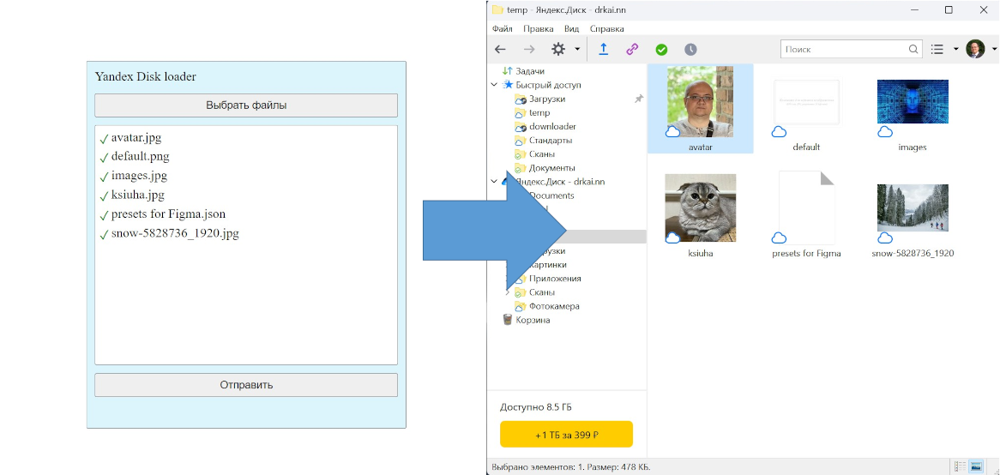

# test-yandex-disk-loader

Приложение реализует выгрузку произвольного кол-ва файлов, вводимых пользователем, на Яндекс Диск.

### Внешний вид

Перед началом использования необходимо:
- зарегистрироваться в облачном сервисе Яндекс: https://yandex.ru/dev/id/doc/ru/register-client#platforms
- получить OAuth-токен для своего приложения: https://yandex.ru/dev/direct/doc/start/token.html
- полученный токен указать в переменной token в src/variable/variable.ts
- в консоли приложения загрузить зависимости, набрав npm i и затем npm run start

Работа в приложении:

- нажмите 'Выбрать файлы' и выберите файлы для отправки
- нажмите 'Отправить' и дождитесь сообщения об успешной отправке
- проверьте содержимое папки temp на вашем Яндек Диск'е.

Технологический стек приложения:
- webpack
- eslint
- react
- typescript
- module scss

Дополнительные возможности:
- npm run build - собрать приложение в режиме development
- npm run start - запуск dev сервера